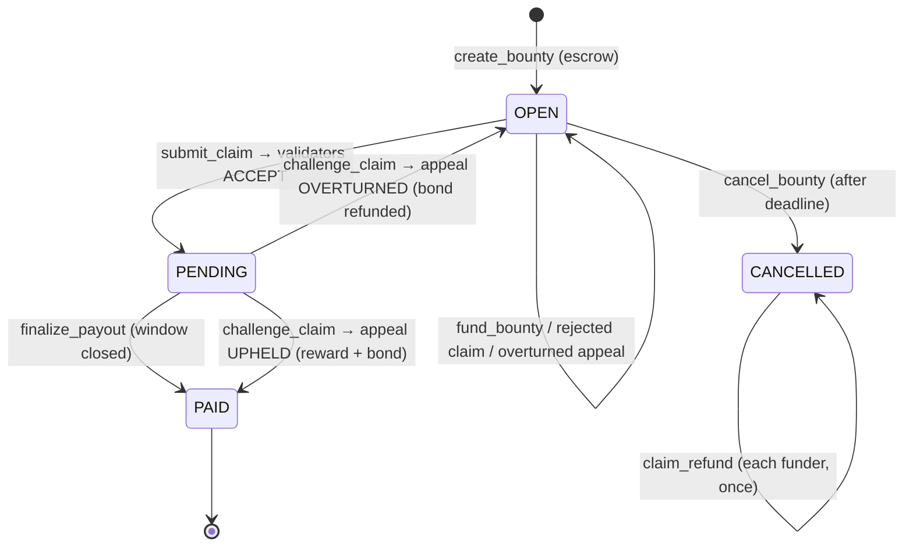

# Milestone: ProofBounty v2 — crowdfunding + optimistic settlement with bonded appeals

> Submit this **only after** the original ProofBounty project has been accepted.
> Base version: `01-project-proofbounty` (v1). This folder is v2.
> Reviewers can see exactly what changed with:
>
> ```bash
> git diff --no-index ../01-project-proofbounty/contracts/proof_bounty.py contracts/proof_bounty.py
> ```
>
> (When split into its own repo, v1 is tagged `v1.0.0` and this work lands as `v2.0.0`; link the compare view.)

## Summary

v1 paid the contributor in the same transaction that the validators accepted
the PR. That is fast but has two real-world gaps:

1. **No recourse.** If an LLM panel was wrong, the money is gone.
2. **Single sponsor.** Popular issues are usually wanted by many people; v1 let only one wallet fund them.

v2 turns ProofBounty into an **optimistic, crowdfunded bounty market** with a
**GenLayer-native appeal path**.

## What changed

| Area | v1 | v2 |
|---|---|---|
| Funding | One sponsor | `fund_bounty` — anyone tops up an open bounty; per-funder accounting |
| Settlement | Immediate payout on ACCEPTED | ACCEPTED → `PENDING` for a sponsor-chosen window (1h–7d); `finalize_payout` by anyone afterwards |
| Disputes | none | `challenge_claim` — any funder posts a bond (≥10% of reward) + written reason; validators re-judge as an **appeal panel** |
| Appeal economics | — | Upheld → contributor gets reward **+ bond**; Overturned → bond refunded, claim marked `OVERTURNED`, bounty reopens |
| Refunds | Push refund to creator on cancel | **Pull-based** `claim_refund` per funder (no unbounded loops, no double refunds) |
| Self-dealing | Creator can't claim | Creator **and every funder** can't claim |
| Events | none | `BountyCreated`, `BountyFunded`, `ClaimEvaluated`, `ClaimChallenged`, `BountyPaid`, `BountyCancelled` |
| Indexing | `get_claims` scanned every claim (O(n)) | Per-bounty claim index (O(k)) |
| Reputation | earned, wins | + rejections, overturned |
| Error classes | `[EXPECTED]`, `[TRANSIENT]` | Full official set: `[EXPECTED]`, `[EXTERNAL]`, `[TRANSIENT]`, `[LLM_ERROR]` |
| Code structure | leader/validator inline | Shared `_evaluate(params)` / `_validate(params, result)` reused by first instance and appeal |
| Frontend | post / claim / verdicts | + fund, challenge window countdown, challenge form with bond, appeal result card, release payout, withdraw refund |
| Tests | 43 direct | **59 direct** (+16: funding, refunds, challenge window, bonds, appeal prompt fencing, appeal validator replay) + new integration test |

## New state machine



## Why the appeal is real consensus, not a rubber stamp

- The appeal re-runs the **entire** pipeline: GitHub facts are re-fetched and the
  diff is re-read; the challenge text is passed as fenced, untrusted *argument*,
  and the prompt instructs the panel to accept a point only if the diff confirms it.
- The validator compares verdict + reason code + every fact, exactly like the first instance.
- Bonds make griefing costly (a frivolous challenge pays the contributor), and only
  people who put money in can challenge.
- One challenge per payout keeps settlement bounded.

## Security review of the new surface

| Risk | Mitigation | Test |
|---|---|---|
| Sponsor cancels during challenge window to dodge payout | `cancel_bounty` requires `OPEN` | `test_cannot_cancel_pending_bounty` |
| Funder claims own crowdfunded bounty | funders blocked from `submit_claim` | `test_funder_cannot_claim` |
| Griefing with cheap challenges | bond ≥ 10% of *current* reward, lost on upheld | `test_bond_and_reason_requirements`, `test_crowdfunder_can_challenge` |
| Prompt injection via challenge reason | delimiter neutralisation + "argument, not evidence" rule | `test_appeal_prompt_includes_fenced_challenge` |
| Leader flips appeal outcome | validator replay rejects mismatched verdict | `test_appeal_validator_rejects_flipped_outcome` |
| Double refund / refund before cancel | contribution zeroed before transfer; status check | `test_pull_refunds_after_cancel` |
| Infinite appeals | single `challenged` flag per pending payout | `test_single_challenge_per_payout` |

## Evidence checklist for the submission form

- [ ] Link to v1 accepted submission
- [ ] Repo link + compare view `v1.0.0...v2.0.0`
- [ ] Deployed v2 contract address (Studionet / Testnet Bradbury) + explorer link
- [ ] Short screen recording: fund → claim → challenge → appeal result
- [ ] CI badge showing 59 direct tests passing
